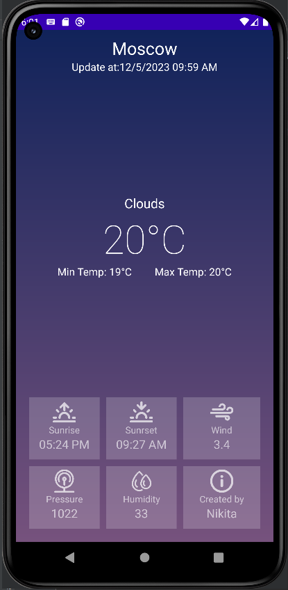

МИНИСТЕРСТВО НАУКИ И ВЫСШЕГО ОБРАЗОВАНИЯ
РОССИЙСКОЙ ФЕДЕРАЦИИ
ФЕДЕРАЛЬНОЕ ГОСУДАРСТВЕННОЕ БЮДЖЕТНОЕ
ОБРАЗОВАТЕЛЬНОЕ УЧРЕЖДЕНИЕ ВЫСШЕГО ОБРАЗОВАНИЯ
«САХАЛИНСКИЙ ГОСУДАРСТВЕННЫЙ УНИВЕРСИТЕТ»

      

Институт естественных наук и техносферной безопасности Кафедра информатики Чагочкин Никита

   

Лабораторная работа №11 «Приложение погода». 01.03.02 Прикладная математика и информатика

            

Научный руководитель 
Соболев Евгений Игоревич

   

г. Южно-Сахалинск 2023 г.

***
# 
Приложение погода 

Реализовать приложение по макету,с помощью https://openweathermap.org/api, реализовать заполнение данными, город назначения выбирайте самостоятельно.
***
# 
Решение 

## 
XML

            <?xml version="1.0" encoding="utf-8"?>
                <RelativeLayout xmlns:android="http://schemas.android.com/apk/res/android"
                    xmlns:app="http://schemas.android.com/apk/res-auto"
                    xmlns:tools="http://schemas.android.com/tools"
                    android:layout_width="match_parent"
                    android:layout_height="match_parent"
                    tools:context=".MainActivity"
                    android:background="@drawable/background_gradient">

                    <LinearLayout
                        android:id="@+id/header_layout"
                        android:layout_width="match_parent"
                        android:layout_height="100dp"
                        android:orientation="vertical">

                        <TextView
                            android:id="@+id/city_text"
                            android:layout_marginTop="10dp"
                            android:layout_width="wrap_content"
                            android:layout_height="wrap_content"
                            android:text="Yuzno-Sakhalinsk"
                            android:layout_gravity="center_horizontal"
                            android:textColor="@color/white"
                            android:textSize="26dp"
                            />

                        <TextView
                            android:id="@+id/updateTime_text"
                            android:layout_width="wrap_content"
                            android:layout_height="wrap_content"
                            android:text="Update at:06.05.23 10:31 AM"
                            android:layout_gravity="center_horizontal"
                            android:textColor="@color/white"
                            android:textSize="16dp"/>
                    </LinearLayout>

                    <LinearLayout
                        android:id="@+id/temp_layout"
                        android:layout_width="match_parent"
                        android:layout_height="200dp"
                        android:layout_below="@id/header_layout"
                        android:layout_centerHorizontal="true"
                        android:layout_marginTop="150dp"
                        android:orientation="vertical">

                        <TextView
                            android:id="@+id/weather_text"
                            android:layout_width="wrap_content"
                            android:layout_height="wrap_content"
                            android:layout_gravity="center_horizontal"
                            android:text="Haze"
                            android:textAlignment="center"
                            android:textColor="@color/white"
                            android:textSize="20dp" />

                        <TextView
                            android:id="@+id/temp_text"
                            android:layout_width="wrap_content"
                            android:layout_height="wrap_content"
                            android:layout_gravity="center_horizontal"
                            android:text="6\u00B0C"
                            android:textColor="@color/white"
                            android:textSize="60dp"
                            android:fontFamily="sans-serif-thin"/>

                        <LinearLayout
                            android:layout_width="300dp"
                            android:layout_height="wrap_content"
                            android:layout_gravity="center_horizontal"
                            android:orientation="horizontal">

                            <TextView
                                android:id="@+id/minTemp"
                                android:layout_width="wrap_content"
                                android:layout_height="wrap_content"
                                android:layout_weight="1"
                                android:text="Min Temp: -3\u00B0C"
                                android:textAlignment="center"
                                android:textColor="@color/white"
                                android:textSize="16dp" />

                            <TextView
                                android:id="@+id/maxTemp"
                                android:layout_width="wrap_content"
                                android:layout_height="wrap_content"
                                android:layout_weight="1"
                                android:text="Max Temp: 13\u00B0C"
                                android:textAlignment="center"
                                android:textColor="@color/white"
                                android:textSize="16dp" />
                        </LinearLayout>
                    </LinearLayout>

                    <LinearLayout
                        android:id="@+id/footer_layout"
                        android:layout_width="match_parent"
                        android:layout_height="240dp"
                        android:orientation="vertical"
                        android:layout_alignParentBottom="true"
                        android:padding="20dp">

                        <LinearLayout
                            android:layout_width="match_parent"
                            android:layout_height="match_parent"
                            android:orientation="horizontal"
                            android:layout_weight="1"
                            android:layout_marginBottom="5dp">

                            <LinearLayout
                                android:layout_width="match_parent"
                                android:layout_height="100dp"
                                android:background="#30FFFFFF"
                                android:layout_weight="1"
                                android:layout_marginRight="10dp"
                                android:orientation="vertical">
                                <ImageView
                                    android:layout_width="match_parent"
                                    android:layout_height="35dp"
                                    app:srcCompat="@drawable/sunrise_white"
                                    android:layout_marginTop="5dp"
                                    android:alpha="0.7"
                                    >
                                </ImageView>
                                <TextView
                                    android:layout_width="match_parent"
                                    android:layout_height="wrap_content"
                                    android:text="Sunrise"
                                    android:textSize="14dp"
                                    android:textColor="#99FFFFFF"
                                    android:textAlignment="center"></TextView>
                                <TextView
                                    android:id="@+id/sunrise_time"
                                    android:layout_width="match_parent"
                                    android:layout_height="wrap_content"
                                    android:text="06:40 AM"
                                    android:textSize="18dp"
                                    android:textColor="#99FFFFFF"
                                    android:textAlignment="center"></TextView>

                            </LinearLayout>
                            <LinearLayout
                                android:layout_width="match_parent"
                                android:layout_height="100dp"
                                android:background="#30FFFFFF"
                                android:layout_weight="1"
                                android:layout_marginRight="10dp"
                                android:orientation="vertical">
                                <ImageView
                                    android:layout_width="match_parent"
                                    android:layout_height="35dp"
                                    app:srcCompat="@drawable/sunset_white"
                                    android:layout_marginTop="5dp"
                                    android:alpha="0.7"
                                    >
                                </ImageView>
                                <TextView
                                    android:layout_width="match_parent"
                                    android:layout_height="wrap_content"
                                    android:text="Sunrset"
                                    android:textSize="14dp"
                                    android:textColor="#99FFFFFF"
                                    android:textAlignment="center"></TextView>
                                <TextView
                                    android:id="@+id/sunset_time"
                                    android:layout_width="match_parent"
                                    android:layout_height="wrap_content"
                                    android:text="20:42 AM"
                                    android:textSize="18dp"
                                    android:textColor="#99FFFFFF"
                                    android:textAlignment="center"></TextView>

                            </LinearLayout>
                            <LinearLayout
                                android:layout_width="match_parent"
                                android:layout_height="100dp"
                                android:background="#30FFFFFF"
                                android:layout_weight="1"
                                android:orientation="vertical">

                                <ImageView
                                    android:layout_width="match_parent"
                                    android:layout_height="35dp"
                                    android:layout_marginTop="5dp"
                                    app:srcCompat="@drawable/wind_white"
                                    android:alpha="0.7"></ImageView>
                                <TextView
                                    android:layout_width="match_parent"
                                    android:layout_height="wrap_content"
                                    android:text="Wind"
                                    android:textSize="14dp"
                                    android:textColor="#99FFFFFF"
                                    android:textAlignment="center"></TextView>
                                <TextView
                                    android:id="@+id/wind_text"
                                    android:layout_width="match_parent"
                                    android:layout_height="wrap_content"
                                    android:text="4.5"
                                    android:textSize="18dp"
                                    android:textColor="#99FFFFFF"
                                    android:textAlignment="center"></TextView>

                            </LinearLayout>
                        </LinearLayout>

                        <LinearLayout
                            android:layout_width="match_parent"
                            android:layout_height="match_parent"
                            android:orientation="horizontal"
                            android:layout_weight="1"
                            android:layout_marginTop="5dp">
                            <LinearLayout
                                android:layout_width="match_parent"
                                android:layout_height="100dp"
                                android:background="#30FFFFFF"
                                android:layout_weight="1"
                                android:layout_marginRight="10dp"
                                android:orientation="vertical">
                                <ImageView
                                    android:layout_width="match_parent"
                                    android:layout_height="35dp"
                                    app:srcCompat="@drawable/pressure_white"
                                    android:layout_marginTop="5dp"
                                    android:alpha="0.7"
                                    >
                                </ImageView>
                                <TextView
                                    android:layout_width="match_parent"
                                    android:layout_height="wrap_content"
                                    android:text="Pressure"
                                    android:textSize="14dp"
                                    android:textColor="#99FFFFFF"
                                    android:textAlignment="center"></TextView>
                                <TextView
                                    android:id="@+id/pressure_text"
                                    android:layout_width="match_parent"
                                    android:layout_height="wrap_content"
                                    android:text="850"
                                    android:textSize="18dp"
                                    android:textColor="#99FFFFFF"
                                    android:textAlignment="center"></TextView>

                            </LinearLayout>
                            <LinearLayout
                                android:layout_width="match_parent"
                                android:layout_height="100dp"
                                android:background="#30FFFFFF"
                                android:layout_weight="1"
                                android:layout_marginRight="10dp"
                                android:orientation="vertical">
                                <ImageView
                                    android:layout_width="match_parent"
                                    android:layout_height="35dp"
                                    app:srcCompat="@drawable/humidity_white"
                                    android:layout_marginTop="5dp"
                                    android:alpha="0.7"
                                    >
                                </ImageView>
                                <TextView
                                    android:layout_width="match_parent"
                                    android:layout_height="wrap_content"
                                    android:text="Humidity"
                                    android:textSize="14dp"
                                    android:textColor="#99FFFFFF"
                                    android:textAlignment="center"></TextView>
                                <TextView
                                    android:id="@+id/humidity_text"
                                    android:layout_width="match_parent"
                                    android:layout_height="wrap_content"
                                    android:text="54"
                                    android:textSize="18dp"
                                    android:textColor="#99FFFFFF"
                                    android:textAlignment="center"></TextView>

                            </LinearLayout>
                            <LinearLayout
                                android:layout_width="match_parent"
                                android:layout_height="100dp"
                                android:background="#30FFFFFF"
                                android:layout_weight="1"
                                android:orientation="vertical">
                                <ImageView
                                    android:layout_width="match_parent"
                                    android:layout_height="35dp"
                                    app:srcCompat="@drawable/info_white"
                                    android:layout_marginTop="5dp"
                                    android:alpha="0.7"
                                    >
                                </ImageView>
                                <TextView
                                    android:layout_width="match_parent"
                                    android:layout_height="wrap_content"
                                    android:text="Created by"
                                    android:textSize="14dp"
                                    android:textColor="#99FFFFFF"
                                    android:textAlignment="center"></TextView>
                                <TextView
                                    android:layout_width="match_parent"
                                    android:layout_height="wrap_content"
                                    android:text="Nikita"
                                    android:textSize="18dp"
                                    android:textColor="#99FFFFFF"
                                    android:textAlignment="center"></TextView>

                            </LinearLayout>

                        </LinearLayout>
                    </LinearLayout>

                </RelativeLayout>

## 
Заполнение данными

В файле AndroidManifest я прописал доступ для выхода в интернет

    <uses-permission android:name="android.permission.INTERNET"/>

В файле build.gradle я добавил зависимость для библиотеке Volley

    implementation 'com.android.volley:volley:1.2.1'

Написал метод для получения информации и парсинга данных

    private fun getWeather(City:String,Country:String){
        val url="https://api.openweathermap.org/data/2.5/weather?q=$City,$Country&APPID=$API_KEY"
        val queue=Volley.newRequestQueue(this)
        val stringRequest = StringRequest(Request.Method.GET,
            url,
            {
                    response->
                val obj = JSONObject(response)
                findViewById<TextView>(R.id.city_text).text=obj.getString("name")
                //вытаскиваем основные данные
                var temp = obj.getJSONObject("main")
                findViewById<TextView>(R.id.temp_text).text=ToCelsius(temp.getString("temp"))+"\u00B0C"
                findViewById<TextView>(R.id.maxTemp).text="Max Temp: "+ToCelsius(temp.getString("temp_max"))+"\u00B0C"
                findViewById<TextView>(R.id.minTemp).text="Min Temp: "+ToCelsius(temp.getString("temp_min"))+"\u00B0C"
                findViewById<TextView>(R.id.pressure_text).text=temp.getString("pressure")
                findViewById<TextView>(R.id.humidity_text).text=temp.getString("humidity")
                //вытаскиваем скорость ветра
                temp=obj.getJSONObject("wind")
                findViewById<TextView>(R.id.wind_text).text=temp.getString("speed")
                //вытаскиваем текущую погоду
                var Arr=obj.getJSONArray("weather")
                temp= JSONObject(Arr[0].toString())
                findViewById<TextView>(R.id.weather_text).text=temp.getString("main")
                Log.d("MyLog","Volley res:$Arr")
                //вытаскиваем время обновления
                temp=obj.getJSONObject("sys")
                findViewById<TextView>(R.id.updateTime_text).text="Update at:"+ UpdateTime(obj.getString("dt"))
                //восход-закат
                temp=obj.getJSONObject("sys")
                findViewById<TextView>(R.id.sunrise_time).text=SunRiseSet(temp.getString("sunrise"))
                findViewById<TextView>(R.id.sunset_time).text=SunRiseSet(temp.getString("sunset"))

            },
            {
                Log.d("MyLog","Volley error: $it")
            }
        )
        queue.add(stringRequest)
    }

Так-же добавил метод для преобразования градусов кельвина в цельсии

    private fun ToCelsius(Kelvin:String):String{
        var temp:Double=Kelvin.toDouble()
        temp=temp-273.15
        return temp.roundToInt().toString()
    }

И 2 методла для обработки UNIX времени

    private fun UpdateTime(unixTime:String):String{
        val sdf = java.text.SimpleDateFormat("dd/M/yyyy hh:mm a")
        var temp:Long=unixTime.toLong()*1000
        val date = java.util.Date(temp)
        return sdf.format(date)
    }

    private fun SunRiseSet(unixTime: String):String{
        val sdf = java.text.SimpleDateFormat("hh:mm a")
        var temp:Long=unixTime.toLong()-28800
        val date = java.util.Date(temp*1000)
        return sdf.format(date)
    }